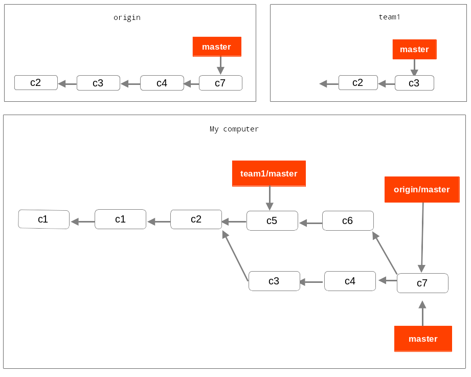
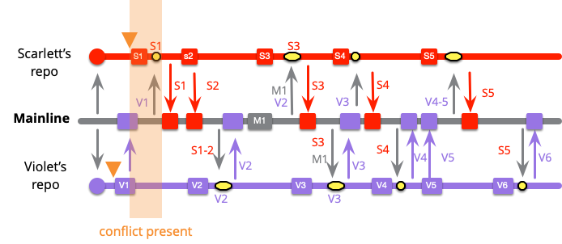

# Git Introduction

## What is Git?

A free open-source distributed VSC "version control system".
**Version control systems:** Git help in tracking and saving changes made in code by providing a history of changes made in code which enables developers to add code in parallel.
**Distributed control system:** Git works in a repository that exists on a server and local repositories each have access to the full history which make help in case of server crash or data to easily recover data from local repositories

## Why Git?

Git is not the only VCS but the most famous and widely used. but git **doesn't save changes** instead **saves changes files** meaning that any changes in file git recognize as a different file, which helps in finding corrupted data but more importantly it makes git **very very fast** when jumping to different points in history, other VCS that saves changes done in each file need to generate that point in history by tracing changes, while it's space-efficient, That takes a lot more time to compute especially in big projects, and any loss to a part of history may lead permanent loss of data. So git sacrifice some space for a fast, reliable, and simple system

## Get Started with git

#### Download Git

- [Windows](https://git-scm.com/download/win)
- [Mac](https://git-scm.com/download/mac)
- [Linus](https://git-scm.com/download/linux)

    Verify if Git is installed by using the following command in the command prompt:

    ```shell
    $ git --version
        git version 2.32.0
    ```

### First Time Configurations

```shell
$ git config --global user.name "John Doe"
$ git config --global user.email johndoe@example.com
$ git config --global core.editor nano
$ git config --global merge.tool meld 
```

### Git Basics

#### Create a repository

a repository is where track and save changes

- `initialize` new local repository :

    ```shell
    $ git init
    ```

- `clone`an existing one :

    ``` shell 
    $ git clone <URL>
    ```

    a hidden folder is created `.git/` where git lives


#### Tracking Changes In Repository

Files in git have 4 states to view

```shell
$ git status
```

- **untracked**: 
    When you add files to a repository or create a new repository, Files are untracked which means that git doesn't track the changes done to these files

    ```shell
    $ echo "hello" > message.txt
    $ git status
        On branch master
        No commits yet
        
        Untracked files:
          (use "git add <file>..." to include in what will be committed)
            message.txt
        
        nothing added to commit but untracked files present (use "git add" to track)
    ```

- **staged**:
    After writing or modifying files you need to tell git which files to track its changes by adding them to `staging area` before committing changes to the repository

    ```shell
    $ git add message.txt
    $ git status
        On branch master
        
        No commits yet
        
        Changes to be committed:
          (use "git rm --cached <file>..." to unstage)
            new file:   message.txt
    ```

- **Modified staged**:
   If you made any changes after stagging files to be committed before committing you need to add them again for git to see new changes **only staged modification get committed** 

    ```shell
    $ echo "hello world" > message.txt
    $ git status
        On branch master
        
        No commits yet
        
        Changes to be committed:
          (use "git rm --cached <file>..." to unstage)
            new file:   message.txt
        
        Changes not staged for commit:
          (use "git add <file>..." to update what will be committed)
          (use "git restore <file>..." to discard changes in working directory)
            modified:   message.txt
    ```

    Notice there are two states for message.txt, one is the previous stage changes "hello" under the `Changes to be committed` which is the staged files, the other is under `Changes not staged for commit` which means if I commit now git would only save the version where message.txt has the word "hello"
    Note that when you stage new changes the **previously staged version is lost** be careful to commit your staged files before adding more files

    Committing changes

    ```shell
    $ git commit -m "add message.txt"
    $ git add message.txt
    $ git commit -m "modified the message"
    $ git status
        On branch master
        nothing to commit, working tree clean
    ```

- **Modified untracked**: same as previous, modified commited files shows under `Changes not staged for commit` as mmodified

    ```shell
    $ echo "hello world !!!!" > message.txt
    $ git status
        On branch master
        Changes not staged for commit:
        (use "git add <file>..." to update what will be committed)
        (use "git restore <file>..." to discard changes in working directory)
            modified:   message.txt
    ```

#### History

you can see previous changes and details the commit and get commit id

```shell
$ git log
    commit e6133c2dcfaca6f80c0e88f3909e7aecf39ec49e (HEAD -> master)
    Author: ali <ali.maher.1460@gmail.com>
    Date:   Sun Jan 23 13:36:20 2022 +0200

        modified the message

    commit f7225366b74dbc04579a64b75dadf47b5ea42291
    Author: ali <ali.maher.1460@gmail.com>
    Date:   Sun Jan 23 13:10:49 2022 +0200

        add message.txt
```

#### Branching

A branch is a separate line of development in the git history, you make to work on part of a project to implement and test a feature without affecting the main branch of the code and can be merged with the main branch at any point in time

- Our repository

    `Head` is pointer to current commit in history

    

- Create a new branch

    ```shell
    $ git branch iss53
    ```

    

- Switch branches

    ```shell
    $ git checkout iss53 # adding -b option, create a branch, and switch to it without $ git branch
    ```

    

- Making a commit in branch iss53

    ```shell
    $ git commit -m " first commit in iss53"
    ```

    

- Switch to main/master branch

    ```shell
    $ git branch main
    ```

    

- Commit in main

    ```shell
    $git commit -m "new commit"
    ```

    
- Merge branches

    ```shell
    $git merge iss53
    ```

    

#### Git Ignore

You can tell git to ignore certain files and folders in the repository by making a file in the root called `.gitignore`, you can write file names or use wild cards. usually, you want to ignore files that get generated automatically like libraries or build files or binary files. For common cases [gitignore templates](https://github.com/github/gitignore) help as a base for your gitignore file

### Git local Workflows

While there isn't a standardized process when dealing with git, the whole team must follow the same workflow. and some workflows are known to be more helpful and organized and raise the efficiency of the team

#### Long-Running Branch

The idea is to have a stable, ready-to-release branch-like **main / master** and create one or more branches to be used in the long run in development, or testing, and when you finished a milestone you implement it into the main branch. and you can implement more branches with different level of stability from testing a feature and when it reaches a stable level you can merge it to a more stable branch, this approach is useful in big projects.


Commits happen outside the stable branch to avoid conflicts as it gets harder to merge the more different their history is

#### Topic branch

It's a short-lived branch that is created for a very specific purpose. the changes in the branch are related to that purpose only.

- creating multiple topic branches to **solve issues** and *try another** method to solve it** and try to **implement some idea**

    

- you like the idea then merge it with master and then you solved the issue with the second solution

    

### Remote Branches

for collaboration between multiple developers git offers remote repositories where each developer has the complete history of the repository

- Clone repository

    ```shell
    $ git clone http://github.com/some/repo.git
    ```

    

- Each side is branching to different histories

    

- Synchronize local history and references with remote

    ```shell
    $ git fetch origin
    ```

    
- Add another remote

    `git clone` adds the remote server as origin by default but you can add other remote repositories

    ```shell
    $ git remote add team1 git://team.one.url
    ```

    

- Push your branch

    To synchronize to the local branch you need to push it to a remote server, 

    If there is conflict try doing fetch then merge or `$ git pull` which merge the local branch with the remote branch to solve the conflict and then push the merged branch

    ```shell
    $ git fetch origin master
    ```

    

    ```shell
    $ git merge origin/master
    ```

    

    ```shell
    $ git push origin master
    ```

    

### Remote Workflows

we will discuss possible ways to manage the relationship between the remote repositories in your team, these are not strict rules but common practices so you can modify them depending on your requirements

#### Centralized Workflow

It has one central repository that all the developer push their changes to it


#### Integration-Manager Workflow

This workflow is commonly used by code hosting websites like Github, where developers fork a Github public repository to their account, public repository is where the developers push their code, after reaching a stable version of developer code, you make a pull request to the **integration-manger** or the **repository maintainer** to pull your changes and merge them to with the main repository


#### Dictator and Lieutenants Workflow

This workflow is used mainly in very big projects where there is a need to split the projects into multiple parts and each part has its own **integration-manger** called **Lieutenants** where developer forks from sending pull requests to him to merge their work, all **Lieutenants** work under one **Dictator**, the one responsible to merge the lieutenant's repository to the main project. the most famous example is the repository of the Linux kernel.


### Integration Frequency

It's how often you integrate changes to the main branch or main repository, the more you merge changes with the main branch the less risk and work there is when merging remote/local branches

#### Low Frequency

the less frequent you integration with mainline, the more conflict and work needs to be done to resolve the conflict.


#### High Frequency

integrating more frequently makes it easier with less work to resolve conflict due to small differences between branches.



Teams that get some bad integration experience may tend to do integration less frequent, the right course of action is to integrate more, more integration leads to a lot of testing, redesign, modifying, on a small scale which leads to small changes every day which is better than costly, time-consuming bigger problem that results from big conflicts

Marting Flower says " **if it hurts do .... it more often**"


### Continouse-Integration

you integrate whenever you made big progress

- you integrate on daily basis to mainline
- you should never leave code at local not integrated at the end of the day
- some advanced developers may integrate more than once a day
- for non-stable features, developer can implement the logic, test but deny access to the feature until it's complete by removing from UI or not allowing user access

## Resources

- [Git Pro - Apress](https://git-scm.com/book/en/v2)

- [Learn git - Atlassian](https://www.atlassian.com/git)

- [Patterns for Managing Source Code Branches - martin flower](https://martinfowler.com/articles/branching-patterns.html)

- [Frequency Reduces Difficulty - martin flower](https://martinfowler.com/bliki/FrequencyReducesDifficulty.html)
